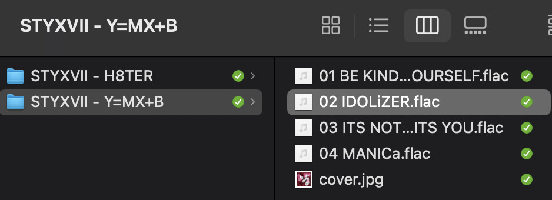

*originally posted on [tumblr](https://www.tumblr.com/stellophiliac/757034541542195200/how-to-build-a-digital-music-collection-and-stuff) on july 26th*

***
spotify sucks aaaass. so start downloading shit!!

## file format glossary

.wav is highest quality and biggest

.mp3 is very small, but uses lossy compression which means it's lower quality

.flac is smaller than .wav, but uses lossless compression so it's high quality

.m4a is an audio file format that apple uses. that's all i really know

## downloading the music

doubledouble.top is a life saver. you can download from a variety of services including but not limited to apple music, spotify, soundcloud, tidal, deezer, etc. 

i'd recommend ripping your music from tidal or apple music since they're the best quality (i think apple music gives you lossless audio anyway. .m4a can be both lossy and lossless, but from the text on doubledouble i assume they're ripping HQ files off apple music)

i also love love love cobalt.tools for ripping audio/video from youtube (they support a lot of other platforms too!)

of course, many artists have their music on bandcamp — purchase or download directly from them if you can. bandcamp offers a variety of file formats for download

## file conversion

if you're downloading from apple music with doubledouble, it spits out an .m4a file. 

.m4a is ok for some people but if you prefer .flac, you may wanna convert it. ffmpeg is a CLI (terminal) tool to help with media conversion

if you're on linux or macOS, you can use parameter expansion to batch convert all files in a folder. put the files in one place first, then with your terminal, cd into the directory and run:

for i in *.m4a; do ffmpeg -i "$i" "${i%.*}.flac"; done

this converts from .m4a to .flac — change the file extensions if needed.

## soulseek

another way to get music is through soulseek. soulseek is a peer-to-peer file sharing network which is mainly used for music. nicotine+ is a pretty intuitive (and open-source) client if you don't like the official one.

you can probably find a better tutorial on soulseek somewhere else. just wanted to make this option known

it's bad etiquette to download from people without sharing files of your own, so make sure you've got something shared. also try to avoid queuing up more than 1-2 albums from one person in a row

## tagging & organizing your music

tagging: adding metadata to a music file (eg. song name, artist name, album) that music players can recognize and display

if you've ripped music from a streaming platform, chances are it's already tagged. i've gotten files with slightly incorrect tags from doubledouble though, so if you care about that then you might wanna look into it

i use musicbrainz picard for my tagging. they've got pretty extensive documentation, which will probably be more useful than me

basically, you can look up album data from an online database into the program, and then match each track with its file. the program will tag each file correctly for you (there's also options for renaming the file according to a certain structure if you're into that!)

there's also beets, which is a CLI tool for... a lot of music collection management stuff. i haven't really used it myself, but if you feel up to it then they've got extensive documentation too. for most people, though, it's not really a necessity

how you wanna organize your music is completely up to you. my preferred filestructure is:

artist > album > track # track

## using a music player

the options for this are pretty expansive. commonly used players i see include VLC, foobar2000, clementine (or a fork of it called strawberry), and cmus (for the terminal)

you can also totally use iTunes or something. i don't know what audio players other systems come with

i personally use dopamine. it's a little bit slow, but it's got a nice UI and is themeable plus has last.fm support (!!!)

don't let the github page fool you, you don't have to build from source. you can find the releases here

click the "assets" dropdown on the most recent release, and download whichever one is compatible with your OS

## syncing

if you're fine with your files just being on one device (perhaps your computer, but perhaps also an USB drive or an mp3 player), you don't have to do this

you can sync with something like google drive, but i hate google more than i hate spotify

you can get a free nextcloud account from one of their providers with 2GB of free storage. you can use webDAV to access your files from an app on your phone or other device (documents by readdle has webDAV support, which is what i use)

disroot and blahaj.land are a couple providers i know that offer other services as well as nextcloud (so you get more with your account), but accounts are manually approved. do give them a look though!!

if you're tech-savvy and have an unused machine lying around, look into self-hosting your own nextcloud, or better yet, your own media server. i've heard that navidrome is a pretty good audio server. i unfortunately don't have experience with self-hosting at the moment so i have like zero advice to give here. yunohost seems to be a really easy way to manage a server

## afterword 

i don't know if any of this is helpful, but i just wanted to consolidate my personal advice in one place. fuck big tech. own your media, they could take it away from you at any moment