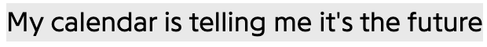
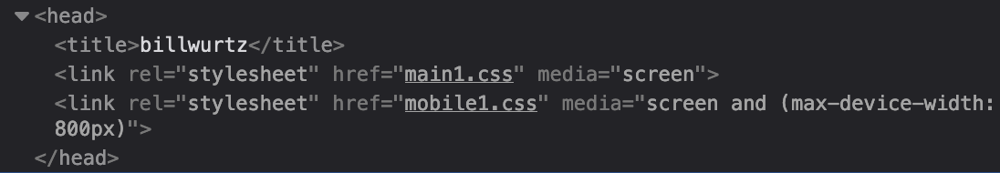
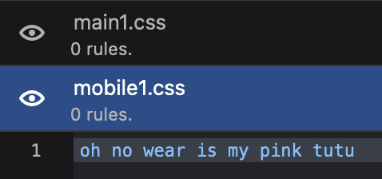

![You got to believe in freedom
Be free to believe in the things you dream of
'Cause that's the way that the best dreams can be dreamed of
When you find a way to believe in them
Don't-don't-do, no-no-woah
Dreams make sense
And all the best dreams will be dreamed again
And on the best days, you'll believe again
That the best dreams can be real again
I just found a better way
And I'll scream it out and hope you see it my way
And I know that you might find a different way
And I hope you scream it back at me (Ungh)](./dreams-make-sense.png)

^ more than a dream

^ fly around

^ 9 8 7

^ just did a bad thing

^ and the day goes on

^ might quit

^ at the airport terminal

^ i'm a princess

^ i'm a huge gamer most of the time

*** 
## bonus fun bill wurtz fact

bill's site loads these two stylesheets in each page, but they don't actually have any code

this is the only thing in both of them. everything on his site is styled inline