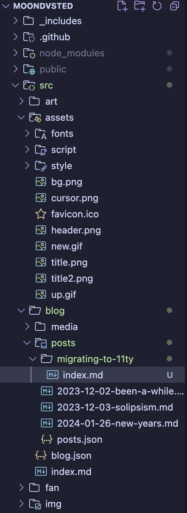
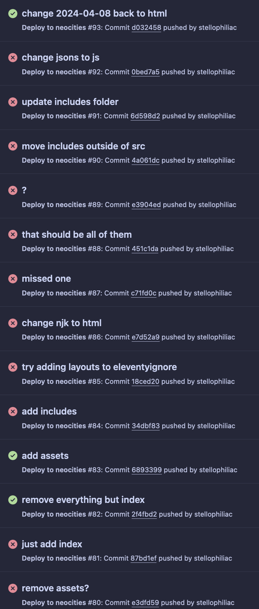

hi! this site is using [11ty](https://www.11ty.dev/) now!

there honestly weren't any problems with my previous setup (and i severely questioned the switch while working on it), but this will reduce some friction for me, *especially* for writing blog posts (they're plain markdown now, and i don't have to update the blog index manually anymore!). ever wonder why you don't hear much from me? that's cause 

1. the whole process is kind of tedious
2. i'm ... not a person with interesting thoughts (or at least the ability to articulate them)

hopefully i'll be writing more soon! 

unfortunately expect a lot of maintenance since i have little to no experience with static site generators. my file structure is slightly fucked but it's somehow better than what i used to have

## changes
* file structure is a little different, most pages that were just .html are in their own folders now cause 11ty does that
* homepage is slightly different
* blog has a slightly new look, didn't change it much because i do like how zonelets styled it
* nuked the art page temporarily, i'll figure out how to set it up soon (the gallery i had before was really nice, but the image descriptions wouldn't show up in the modal ... also couldn't figure out how to do captions)

that's sorta it

## dear god why was this so hard
hi i need to lament about this process.
### the coding
the coding part wasn't too bad! there were a few bumps in the way, but overall it was pretty smooth sailing. it just took a while because i'm uh . lazy

#### filestructure

<figure style="max-width:200px">

<figcaption>goodness me</figcaption>
</figure>

*"i mislike undecision as much as e're a man"* – candidate for world's worst father, or something <small>(anse from as i lay dying)</small>

working out the file structure was a bit stressful for me (*because of course* – i simultaneously am obsessed with organized systems and indecisive as hell) but i'm happy enough with how it's gone . and now that it's done i don't have to worry about it much more

weird thing is that i've got an /assets/ folder with images and an /img/ folder outside of the /assets/ folder – current thought process is that /assets/ is for things actually part of the site design (header, bg, cursor, etc.) and /img/ is for things that are ..... not that (buttons and shit)

#### stylesheets

i've got a "base.css" with basic stuff like colors and link styling which i @import into my other files. before this i had the basic styling copypasted into my blog stylesheet which was.. Weird i think

### actually getting the site on neocities

good *god*

okay so i use [deploy-to-neocities](https://github.com/bcomnes/deploy-to-neocities/tree/master) right. it's great! 

however i had to spend multiple hours figuring out why the Fuck this would not work since my files refused to upload

originally i thought my files were too big or something so i tried pushing each folder one by one. it only took a couple folders since i realized

oh, it's the _includes folder 
oh shit, those have .njk files, don't they 
....... neocities doesn't allow those huh

YEAH it was that easy. i may be dumb!

anyways i then had to find out how to make those not build to the /public/ folder (why would you need that anyway??)

i tried using .eleventyignore but that didn't work . i poked around in some people's source code, and ended up moving the _includes folder out of /src/ and setting the includes folder in .eleventy.js to "../_includes" instead. (thanks to [ghostologaster](https://ghostologaster.neocities.org/) for the indirect help)

to make matters worse there was one random file i forgot to change from .njk back to .html at one point

the way i'm writing this makes it sound a lot more trivial than it was – i'm only covering the most important stuff but there was so much debugging

## looking forward
i'll be maintaining my site, as usual, and hoopefully blogging more .. i've got a few ideas for things to add to my site, and there's still some wip sections up that i need to work on

perhaps i'll add some syntax highlighting, or a digital garden type thing.. ([this seems like it could be fun](https://github.com/kormyen/memex))

i don't have much else to say, so i'll see you ;D  until next time!