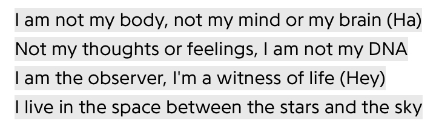

**content warning for discussions of unreality and suicidal ideation and such**

***

i just got new glasses which has been making my vision fucky and inducing more feelings of unreality, which is why i’m writing this

for a while now i haven’t been able to shake the feeling of being unreal in some way. i talked a little bit about it in my [blog post about solipsism](/blog/posts/2023-12-03-solipsism/), i think – i don’t really love rereading things i write. a lot of this post will probably be me repeating/expanding on what i talked about in that post

the world often seems too bright, too blurry, too distant. i feel sometimes like i’m seeing the world through a screen or window of sorts… my glasses may be partly to blame, considering they add a literal frame in my peripheral vision

my entire life feels temporary, like a game that i can just close whenever, like something i’m just occupying my time with before i return to whatever i’m meant to go back to. i’ve had thoughts in the past that have been popping up again recently that i don’t belong in this life and/or this world, that i stole somebody else’s life or that i got misplaced somehow. i don’t know where i’m meant to be, but i don’t feel like i fit here – even when the world around me does feel real, i still often have that feeling of unbelonging.

i’m a singlet, and i’m pretty sure i’ve been around for this entire life, but a lot of the time my past feels fake or like someone else lived through them. i have a hard time understanding that things that happen have actually happened, and are part of the past and set in stone. this is weird to say and kinda hard to explain – hopefully i’m making myself understood at least a little bit. everything feels like a dream i could just wake up from, i guess 

i sometimes can’t understand that the world doesn’t revolve around me. people have their own lives; allegedly, everybody i see on the street is living their own life and has their own feelings and thoughts and consciousness – this is scary to me. for all i know, i’m the only truly conscious being in the universe. this is mainly what i talked about in the other post

this isn’t to say that i believe everyone else in my life are “programmed” flat characters. to me, they feel like something like simulated personalities or AI but infinitely more advanced. they act like people but my mind often has trouble understanding that they have consciousness and sentience in the way that i do .. this is all so difficult to put into words

i think i lack empathy. i’m not sure because i don’t pay much attention to it, but i find that i sometimes do or say bad things to others because i can’t get it in my head that they’re thinking, feeling people 

my body is me in the way that a monopoly piece is me. it’s my means of interacting with this world, but that’s it. the face i see when i look in the mirror is familiar but unfitting 

i move my body awkwardly; i’ve always been shit at sports for a plethora of reasons, one being that i just… don’t move. when i play badminton, i tend to reach for the ball instead of moving towards it. my spacial reasoning is flawed, and i tend to be unaware of the space that my body or things i carry take up. this definitely was a thing before i got hit by the disassociation beam but i feel like it was exacerbated at least a little bit

suicide is on my mind a lot of the time. can you blame me? in my eyes, the world only exists around me. if i cease to exist, so does everything and everyone else. there’s no broken dreams because there’s nobody around to dream, only quiet peacefulness. to me, i’m not hurting anyone because there won’t be a world around to miss me or to grieve me

but at the same time, if the world is merely created around me, then why isn’t everything perfect? is it that i don’t deserve it, or is it to keep me in check

i hear people say sometimes that even if the world is a simulation or all in their head or whatever, they’d still try to make the most of it and maximize their happiness. i get where they’re coming from, but i personally can’t understand. to me, the suffering isn’t worth it for some satisfaction in this made-up world. living is a chore – waking up every morning, school, just taking care of myself and my body; it just doesn’t feel worth it

don’t get me wrong, the little things are worth it sometimes. i love spending time with my friends and making things i’m proud of and all that jazz, but the bad stuff feels so perpetual that it outweighs the good 

i have a lot of weird shitty thoughts in my head that i find hard to express. i’ve tried making art and poetry and stuff but i’ve never really been great at that kind of stuff; rambling on my blog like this seems to come more easily to me

i know i said my blog posts wouldn’t always be this heavy, but i’ll probably write more stuff like this in the future