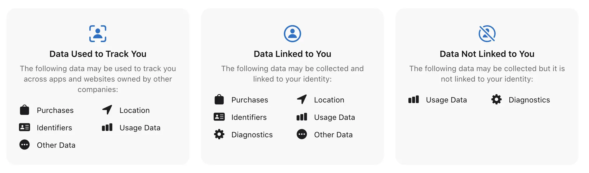

sudoku is a hobby i come back to every once in a while. i'm not exceptionally good at it, i just play on easy or medium difficulty. i haven't looked much into variant sudoku yet — except killer sudoku, which i'm a big fan of.

i've mainly just been playing on sudoku.com and their respective apps, but uh

i wanna play sudoku, but good god, not that bad

unfortunately, i am picky and so apps that fit my tastes are hard to find. tastes as follows:

1. nice, modern, clean-ish look
1. no ads
1. privacy-respecting
1. free

i'd be up to pay for a sudoku app in the future, but at the moment that's not an immediate option. [not evil sudoku](https://apps.apple.com/us/app/not-evil-sudoku/id1614071642) looks wonderful, but unfortunately requires a $5 payment to play more than one a day. once i'm able, this'll probably be the one i buy

there's also quite a few apps that look nice, are free, and are _decently_ private, but have ads. paying to remove ads is an option, but i'd honestly prefer something made by someone who believes in the no-ad philosophy, so to speak

at the moment, i've landed on [nofluff sudoku](https://apps.apple.com/us/app/nofluff-sudoku/id1669990814). "nofluff" is right — this is just sudoku, nothing else, probably even too minimal. there's one theme, it doesn't highlight selected numbers, and there's no timer pausing either. (seriously, it'll keep running even if you exit or completely close the app.) it's completely free though, with no ads or tracking. the minimalism is similar to solving a paper sudoku, i guess.

unfortunately, i'm not great at solving sudokus without number highlighting — i tend to overlook numbers when i'm scanning unless they're highlighted. for the one (1) day i've been using this app, i've only solved one with no mistakes whatsoever. i'll probably get used to it, though!

---

### in other news

watched a solve of a really cool variant sudoku yesterday: [foggy on the details](https://www.youtube.com/watch?v=7KxugQBUi-A). this isn't the type of sudoku i'd be good at, i'm really lacking on logic skills

my friends and i have been playing a lot of job job recently. [relevant tumblr post](https://www.tumblr.com/vedajuno/759378269550395392/would-you-fuck-the-jackbox-water)

till next time!
